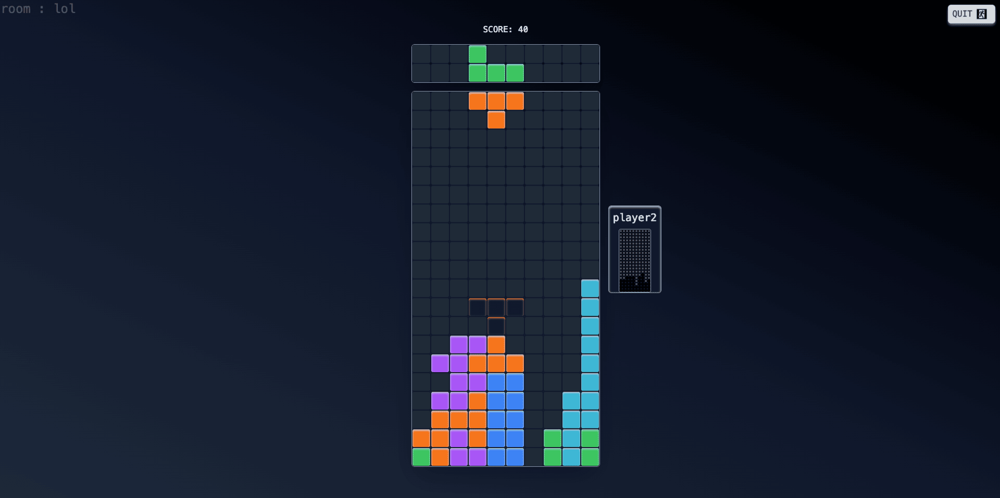
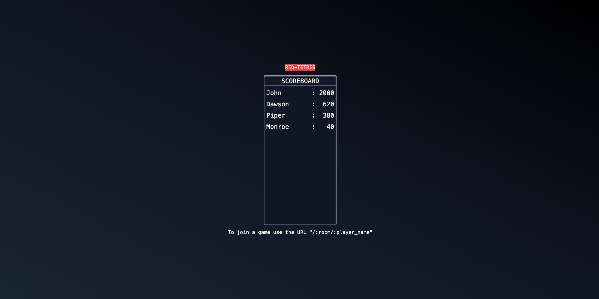

# Red Tetris

## Overview

Red Tetris is a web application that allows users to play a multiplayer version of the classic Tetris game. The game features real-time interaction between players, a leaderboard, and a dynamic playing field. The application is built using modern web technologies and is designed to provide an engaging and competitive gaming experience.

## Table of Contents

1. [Technical Aspects](#technical-aspects)
   - [Frontend](#frontend)
   - [Backend](#backend)
   - [Game Logic](#game-logic)
2. [Features](#features)
   - [Multiplayer Mode](#multiplayer-mode)
   - [Leaderboard](#leaderboard)
   - [Real-time Interaction](#real-time-interaction)
3. [Installation](#installation)
   - [Prerequisites](#prerequisites)
   - [Setup](#setup)
4. [Usage](#usage)
   - [Running the Application](#running-the-application)
   - [Joining a Game Room](#joining-a-game-room)
   - [Playing the Game](#playing-the-game)
5. [Screenshots](#screenshots)
   - [Game Interface](#game-interface)
   - [Leaderboard Screenshot](#leaderboard-screenshot)

## Technical Aspects

### Frontend

The frontend of Red Tetris is built using React and TypeScript. It utilizes Vite as the build tool for fast development and hot module replacement. The frontend is designed to be responsive and provides a smooth user experience.

- **React**: A JavaScript library for building user interfaces.
- **TypeScript**: A statically typed superset of JavaScript that adds optional types.
- **Vite**: A build tool that provides fast development and hot module replacement.
- **Tailwind CSS**: A utility-first CSS framework for rapidly building custom user interfaces.

### Backend

The backend is developed using Node.js and Express. It handles game logic and real-time communication between players. The backend is containerized using Docker for easy deployment and scalability.

- **Node.js**: A JavaScript runtime built on Chrome's V8 JavaScript engine.
- **Express**: A minimal and flexible Node.js web application framework.
- **Socket.IO**: A library that enables real-time, bidirectional communication between web clients and servers.
- **Prisma**: An ORM for Node.js and TypeScript that simplifies database interactions.

### Game Logic

The game logic is implemented in the backend and is designed to handle real-time interactions between players. The game state is managed using Socket.IO for real-time communication and Prisma for database interactions.

## Features

### Multiplayer Mode

Red Tetris supports multiplayer mode, allowing multiple players to compete in real-time. Players can join or create rooms and interact with each other during the game.

### Leaderboard

The application features a leaderboard that displays the scores of all players. The leaderboard is updated in real-time, allowing players to see their rankings and compete with each other.

### Real-time Interaction

The game features real-time interaction between players. Players can see each other's field spectrum letting you see the highest block of each columns of your oponents. Completing lines add indestructible lines to your opponents, providing an engaging and competitive gaming experience.

## Installation

### Prerequisites

- Node.js and npm installed on your machine.
- Docker installed for containerization.

### Setup

1. Clone the repository:

   ```bash
   git clone <repository-url>
   cd red-tetris
   ```

2. Set up the environment variables:

   ```bash
   cp .env-template .env
   ```

3. Build and run the Docker containers:
   ```bash
   docker-compose up --build
   ```

## Usage

### Running the Application

To run the application, use the following command:

```bash
docker-compose up
```

### Joining a Game Room

1. **Access the Application**: Open your web browser and navigate to `http://localhost:${FRONT_PORT}`.
2. **Home Screen**: You will be greeted with the leaderboard home screen.
3. **Joining a Room**: If you have a room name, append it to the URL in the format `http://localhost:${FRONT_PORT}/:room_name/:player_name` to join the room directly.
4. **Creating a Room**: If no existing room, you will automatically create a new room and can invite others by sharing your room URL, you can also choose the starting speed level of the game.

### Playing the Game

1. **Game Interface**: Once in a room, you will see the game interface with the Tetris playing field.
2. **Gameplay**: Use the arrow keys to control the Tetris pieces:
   - **Left Arrow**: Move the piece left.
   - **Right Arrow**: Move the piece right.
   - **Down Arrow**: Move the piece down faster.
   - **Up Arrow**: Rotate the piece.
   - **Spacebar**: Drop the piece instantly.

## Screenshots

### Game Interface



### Leaderboard Screenshot


